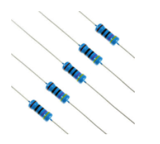
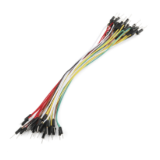
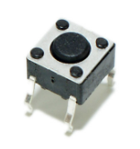

# Apêndice

## Protoboard

Quando você precisa rapidamente e temporariamente protótipo de um circuito, você estará usando um protoboard.
Protoboard são placas que conseguem simular conexões de componentes eletrônicos. Ela possui pequenos oríficios,
aonde conectaremos os nossos fios

## Piezo

Piezo é um sensor que emite um sinal sonoro, tal como uma buzina. Este sinal pode ser criado em uma aplicação
Nodebots a partir de um valor numérico ou uma abstração de notas sonoras, o que torna a sua manipulação mais simples.

## Resistores

Os resistores são vastamente utilizados na eletrônica, send um dos primeiros componentes eletrônicos com o qual
lidamos e um dos que mais utilizaremos. Eles são as bastante pequenos em forma de pílula com listras na maioria das
placas de circuito.

Um resistor é um componente eletrônico que limita o fluxo de elétrons dissipando energia sob a forma de calor, pois a
eletricidade tem que lutar para fluir através de algo com uma alta resistência. Utilizando assim uma grande
quantidade de energia e convertendo isso em calor.

## LED (Light-emitting diode)

LED é uma abreviação de diodo emissor de luz (Light-emitting diode). Um componente do tipo de diodo que emite luz.

## Sensores

Dispositivo que converte dados do mundo real (analógica) em dados que um computador pode entender usando
ADC e convertendo os dados do formato Analógico para o Digital. Utilizaremos sensores para detectarmos eventos ou
mudanças no local e enviaremos para leitura na nossa aplicação.

## Condutor de Proteção (Fio Terra ou Ground)

É o fio de entrada de condutor elétrico que possui a função de "aterrar" todos os dispositivos que precisarem
utilizar seu potencial como referência ou suas propriedades elétricas.

Em sistemas de potência, o terra possui as funções de referência elétrica para a tensão, sistemas de proteção,
controle para excesso de carga/energia e proteção de equipamentos.

## Fios de condução

Fios isolados curto com extremidades sem capa de isolamento que usamos para conectar dois pontos em um circuito ou protoboard.

## Botão

É um mecanismo simples para controlar alguns aspectos de uma máquina ou um processo. Ao clicar no botão a corrente é liberada e ao soltar o botão a corrente é cancelada.

